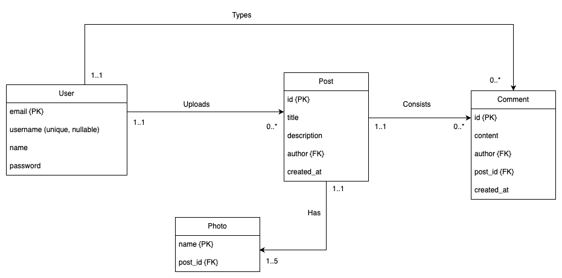

# AWS EB domain

`http://purematch-ebs-env.eba-zcqinfp3.us-east-1.elasticbeanstalk.com/`

## Approach to solving req3

Since posts can now have multiple comments, I created a comments table with post id as the foreign key and the relationship between posts and comments is 1 to many since 1 post can have many posts but 1 comment can belong to only 1 post.
A comment is posted by a user and hence there is also a 1 to many relationship between a user and a comment since a user can have multiple comments but a comment can be posted by only 1 user.

A GET request for a post does not return its comments with the details. This is because I felt keep the two separate avoids unecessary overhead. Like instagram , when we see a post we may not be interested in the comments on that post. Only when a user clicks the comments icon, the comments are fetched for that post sperately.

To implement pagination, I utilized `Sequelize`'s `limit` and `offset` features to fetch only `limit` amount of records starting from the `offset` index.

To get paginated comments, I had to alter the PostService to fetch the records based on the limit and offset instead of fetching all the records together. The concerned routes were also altered to have req.query params which contain the `size` (number of comments on each page) and the `page` number to fetch the details of.

Similarly, for getting all posts and posts of a user in paginated format, I had to alter the request routes ti have 2 req query prams namely `size` and `page` to fetch details of specific records. These params are used to calculated the limit and the offset which is supplied to the database query.

To add the option of `username` for all users, I wrote a database migration script to add this column to the `users` table. This newly added field is nullable since not all users would be interested in setting up custom usernames. The email is still the primary key for each user but each `username` needs to be unique in order to enable login with email/username in the future.

## Rough ER digram of the model after completion

