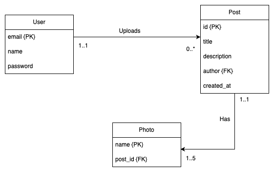

# Approach to solving req2

Since the user can now upload 1-5 photos with each post, the relationship bwetween a post and photos becomes a 1 to many relationship since 1 post can have mutliple photos. In the previous requirement, it was a 1 to 1 relationship and did not need a separate table of its own. Hoever, as per this requirement, the database structure changes (Check the ER diagram below) and I have written the necessary migrations for it.

The concerned migrations are responsible for creating the photos table, adding a photo and post association foreign key, dropping the photo column from the posts table and adding all the removed data to the photos table with the necessary associations.

We also need to add an attribute 'created_at' which lets us know when the post was created. For this I have chosen the following flow:

- When the databse is migrated to add the created_at field, it provides a default value of the current timestamp to all the existing posts. Since we did not record this data in the previous version, I have chosen the creation date as the date since we started recording it.
- We can also go a different way where we can keep this field as nullable and don't assign a default value to the existing entries. All new entries will have a creation date but the older entries will have a null value which can be display as "unknown" to the user.

Since we can upload multiple photos along with a post, we need to use `multer.array` instead of `multer.single` to allow multiple files to be processed together. This required me to do changes to the middleware and add a `maxCount` variables which stores the maximum number of files that can be uploaded with each post.

To support the feature of editing a post, I have added a PATCH and PUT reqest in the post routes. When we need to change certain values like the  `title` or `description` or replace the photo of the post without editing the other details, we can use patch request to perform those updates. However, if we want to completely replace a post's details with the new ones, we can use a PUT request which will either update all contents of the post or add a new post if the referenced post does not exist yet.

To calculate approximately when the post was created, I used the `dayjs` npm package to calculaye the time difference in seconds, mins, hrs, days, weeks, months, years and displayed the largest possible time to the user. It is a rough estimate (like instagram and some other apps) which means that a time difference of 1 yr 7 days is displayed as 1 yr. This can easily be changed with a very small code block.

## Rough ER digram of the model after completion.

