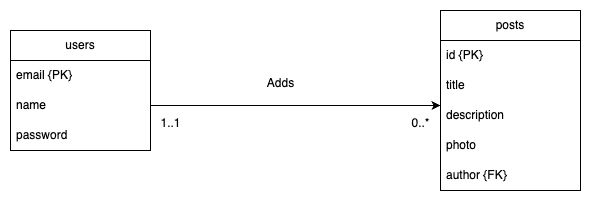

# General approach for all requirements

`req1: master branch`

`req2: req2 branch`

`req3: req3 branch`

For all the requirements, databse is a deployed AWS RDS whose connection details are supplied in env variables. The final project (req3 branch is the latest one) is deployed on AWS EB where it operates without any local dependencies. All images are uploaded to AWS S3.

For all requirements, I created the migration files to make the changes to the database and then typed the command
`npx sequelize-cli db:migrate`

## AWS EB domain

`http://purematch-ebs-env.eba-zcqinfp3.us-east-1.elasticbeanstalk.com/`

## Approach to solving this requirement

For this requirement, the main task was to setup the code repository with an Express.js app, and I have decided to go wih the Model View Controller architecture to increase code readability.

Following the MVC architecture, we have the routes folder which contains all our roites that the user can interact with, we have the controllers which are reponsible for handling the request by oerforming validaions and calling the necessary services to get the data from storage.

`index.js` in the root directory is the main server file which starts the server listening at the mentioned port.
In this file, we import all the necessary packages to setup the express server and also import all the routes that the user can interact with.
There is also an error handler which will be executed whenever there is an internal server error.

All interactions are segregated into 2 different routes, the `user` routes and the `posts` routes.
The `user` routes include all the endpoints that involve the user signing up/loggin in or getting a list of all the users. User's passwords are hashed before storing in the database and we therefore have no knowledge of the user's actual password at any point of time.

When the user logs in, they get a jwt accessToken that has the user's email and their role in the payload and a refreshToken. This access token is required for carrying out any other requests except creating an account. The issued access token expires, the refresh token is fetched from the http cookie and depending on its validity, issues a new acess token or asks the user to login again to generate a new access and refresh token.

To validate whether the user is logged in or not before requests that require authentication, I used middlewares in express. The middlewares are present in the `middlewares` folder. Middlewares in this project are also used for file uploading purposes using multer. FOr filemupload, a created an AWS S3 bucket, and supplied this project with the access key and the secret access key for the bucket. So whenever the user uploads file (only images are allowed), the flow is something like:

1. Check if user is logged in. If no, user is unauthorized.
2. Check if files are images only, if not, throw error.
3. Process the multipart form data using multer
4. Access the file in the request, assign a random unique name to the file, upload it to S3 and store the name of image in the database.

## How to add Authorization header

To add the jwt in request header you need to send it with the Authorization header in the following format:

`Authorization: "Bearer {jwt}"`

For Postman, navigate to Authorization => choose bearer token in type => add the accessToken

Whenever we want to display the image, we can get the image name from the database, and use this name to get a signed url from AWS S3.

Since, there was no mention of whether images uploaded to S3 should be publicly accessible, I chose the more secure version of getting signed urls of photos whenever the user requests them and the generated urls are valid for the enxt 1 hour.

All database migrations are present in the migrarions folder. They help in migrating the database form one state to the other during development.

### Rough ER digram of the model after completion

